# 1.边缘检测

常见的都有垂直方向，水平方向边缘检测，sobel算子

假如把滤波器的参数，用数据自动训练，就可以得到检测任意边缘检测的滤波器

# 2.Padding

卷积计算的缺点：

1.丢失边缘信息：每次做卷积运算，图像就会变小，丢弃边缘信息；

2.角落边的像素，只会计算一次，而图中间的像素，会被卷积计算多次，意味着丢失了边缘许多信息；

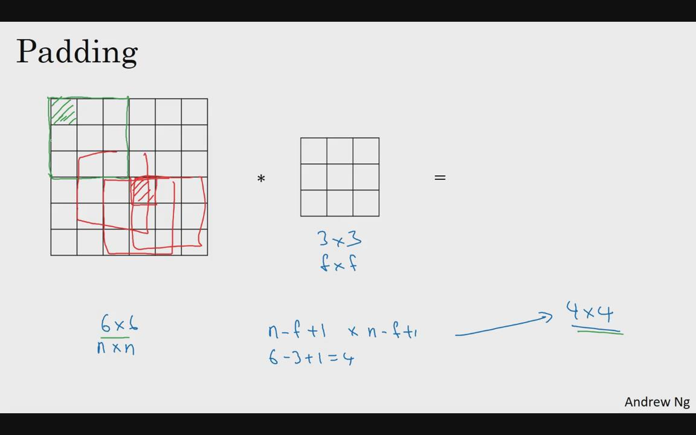

未解决这个问题，在做卷积之前，对图像先做填充

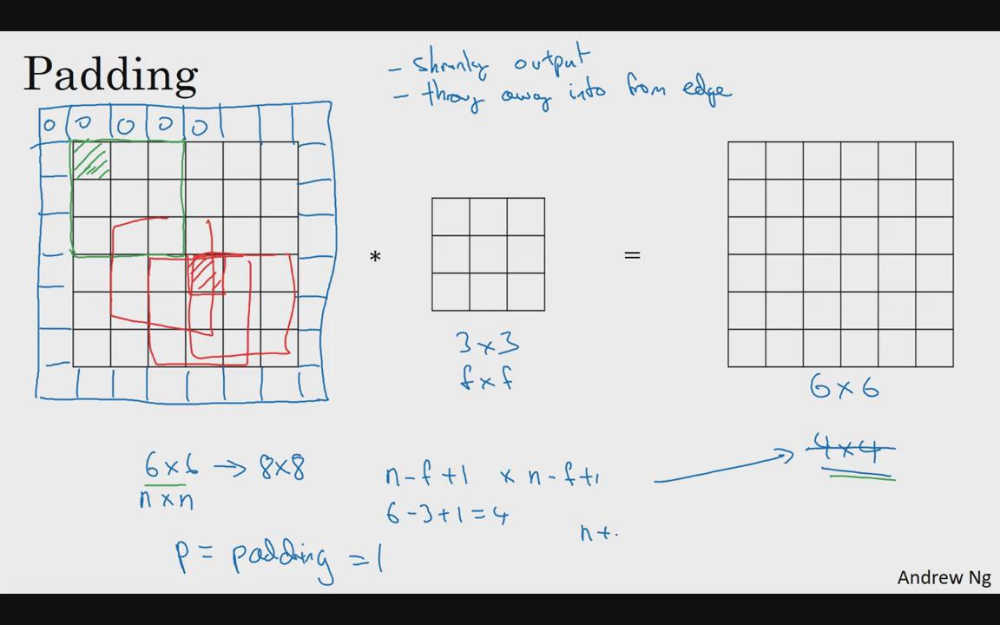

输出变成(n+2p-f+1)*(n+2p-f+1)

这样，角落边缘信息丢失，这个问题影响就削弱了。

至于填充多少像素，一般有两种，分别叫Valid卷积和Same卷积；

Valid卷积：不填充；

Same卷积：填充后，输出大小和输入大小是一样的；

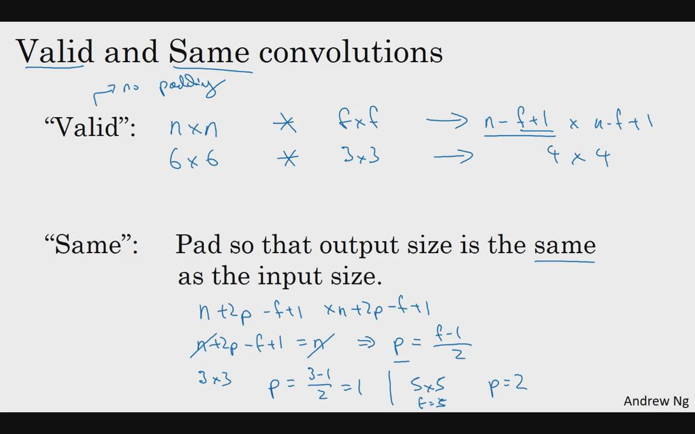

在计算机视觉中，f一般取奇数;可能原因有

原因1：如果去偶数，那只能使用一些不对称的填充；

原因2：奇数维度的卷积，有一个中心点，有时在计算机视觉里，有一个中心像素点会更方便，容易指出卷积位置；

# 3.步长stride

当一个nxn图片，与一个fxf滤波器，做卷积时，其输出尺寸计算如下（向下取整）：


互相关：将滤波器参数翻转，即按水平，垂直方向做镜像

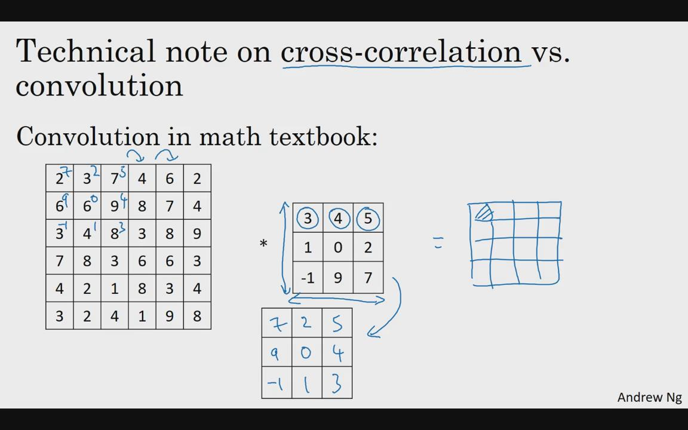

得到新的滤波器，数学家将这叫做互相关；

而在机器学习中，一般统称为卷积，将滤波器参数的翻转视为卷积的性质

对于信号处理来说，这个性质很重要；但是对深度学习来说，这个不重要，因此省略绿这个双重镜像操作；

# 4多维卷积核

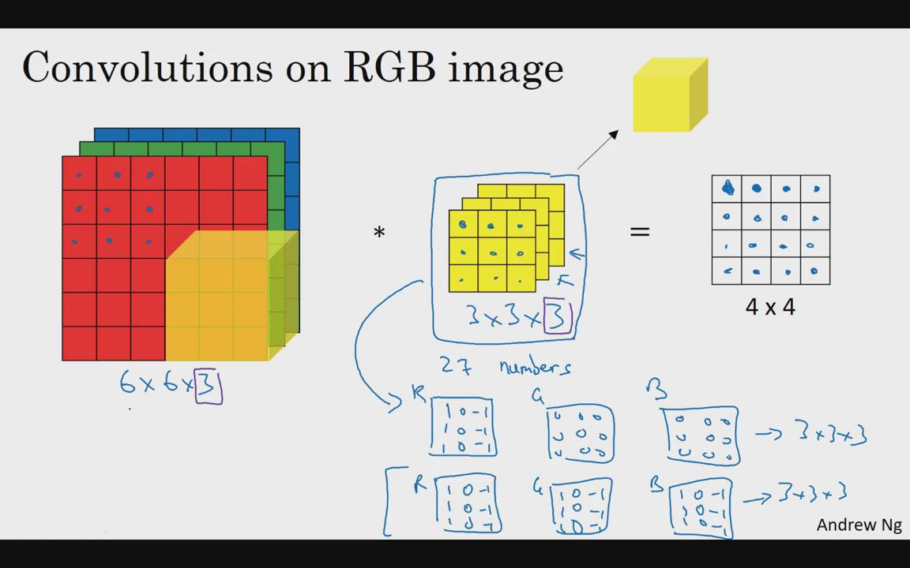

注：可以独立设置每个通道滤波器参数；比如只关注R通道边缘检测...

# 4卷积神经网络示例

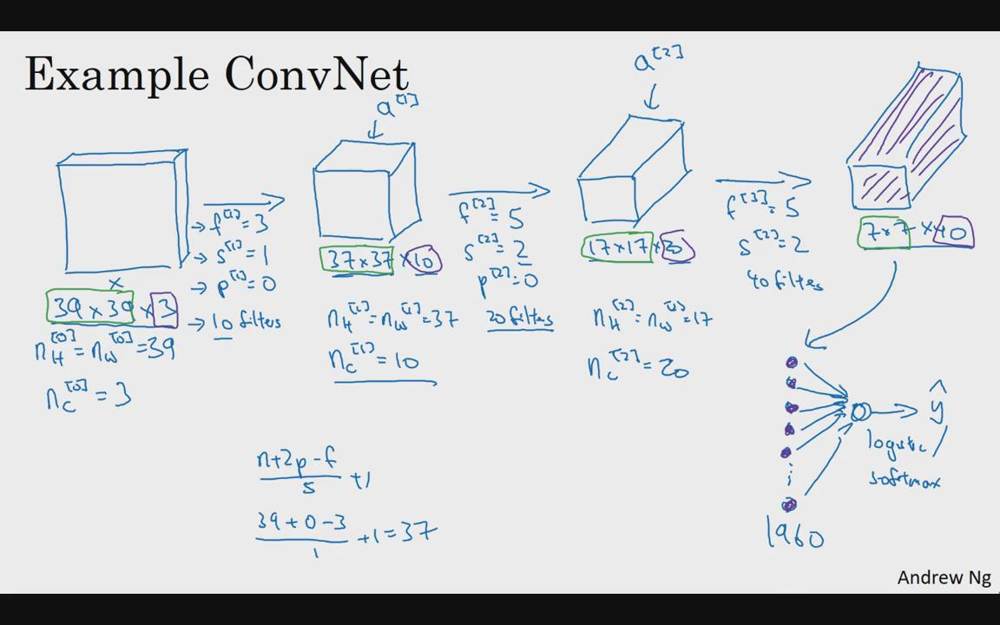

# 5.Pooling

除了卷积层，卷积网络也经常使用池化层，来缩减模型大小，提高计算速度，同时提高所提取特征的鲁棒性；

Pooling layer：Max pooling

意义，某个区域最大值，往往意味着该区域检测出某个特征

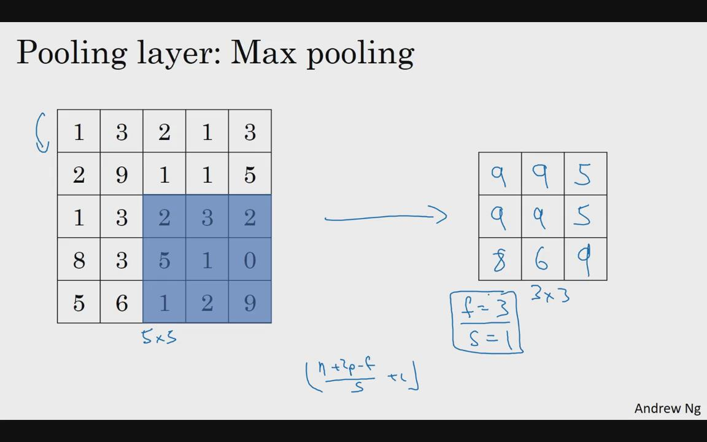

Pooling layer：average pooling

意义，某个区域最大值，往往意味着该区域检测出某个特征

一般来说，最大池化层比平均池化层更常用，但也有例外，就是深度很深的神经网络，
可以用平均池化来分解规模为7x7x1000的网络的表示层；在整个空间内求平均值，得到1x1x1000

最常用的是f=2,s=2，相当于高度和宽度缩减一半


大部分情况下，最大池化很少用到padding，目前p最常用是p=0

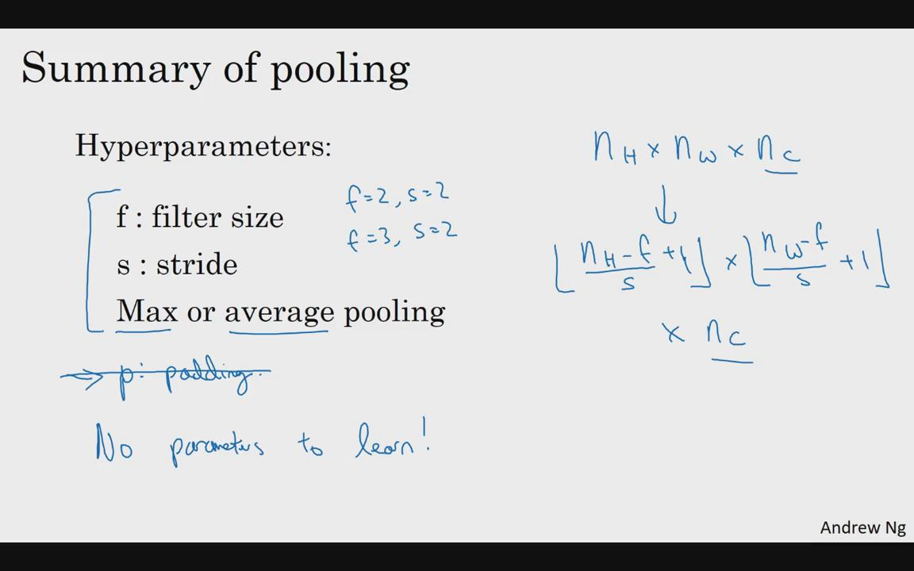

需要注意的一点是，池化过程中没有需要学习的超级参数；只有这些手动设置的参数，也可能是通过交叉验证设置的；
最大池化只是计算神经网络某一层的静态属性，没有什么需要学习的；

# 一个完整的卷积神经网络示例


常规做法是，尽量不要自己设置超级参数，而是查看文献中别人采用了哪些超级参数，选一个在别人任务中效果很好的架构，
那么它也有可能适用于你自己的应用程序；

如果激活值下降太快，也会影响网络性能；


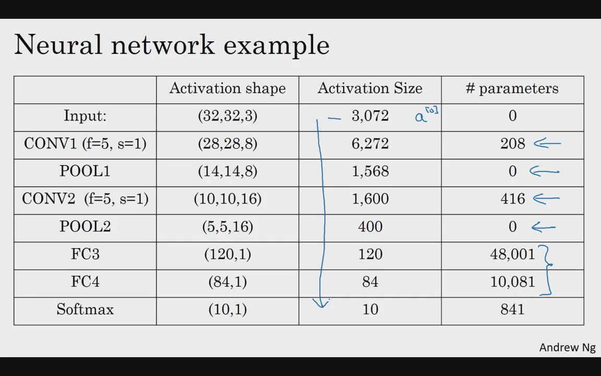

整合这些基本模块确实需要深入的理解和感觉，找到整合基本构造模块的感觉，最好办法就是大量阅读别人的案例，

# 为什么使用卷积

和单纯使用全连接层相对，卷积层的两个主要优势，参数共享和稀疏链接


如上图示，全连接层需要月14000000参数，而卷积层只需156个参数

卷积层能有效减少参数的原因主要有

## 1.共享参数

一个卷积核参数，可以平移，滑过所有像素平面；即卷积具有平移不变性

## 2.稀疏链接

如下图，输出图像的某个点，只与输入图像部分像素有关

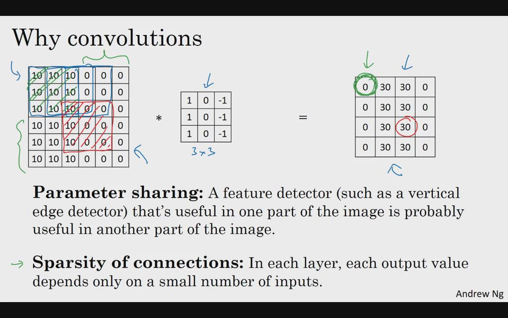


# 将所有模块组织成一个可用的卷积网络示例

输入图片，增加卷积层和池化层，然后添加全连接层，最后softmax输出，得到一个$\hat{y}$

卷积层和全连接层有不同的参数w和偏差b, 我们可以用任何参数集合来定义代价函数；

并随机初始化其参数和偏差，CostJ等于神经网络对整个训练集的预测的损失总和，再除以m；

所以，训练神经网络，你要做的是使用梯度下降法或其他算法，如含动量的梯度下降，含RMSProp或其它因子的梯度下降；

来优化神经网络中的所有参数，以减小代价函数J的值；

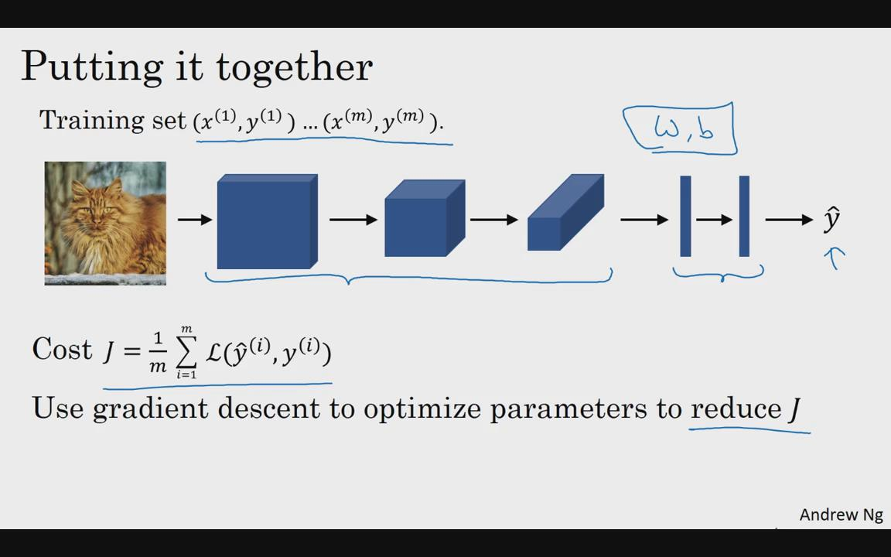

通过上述操作，可以构建一个高效的猫咪或其他检测器；


```python

```


```python

```


```python

```
