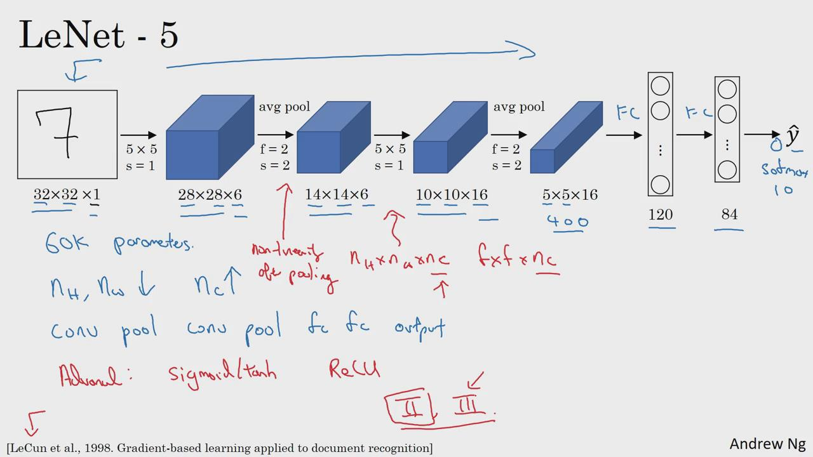
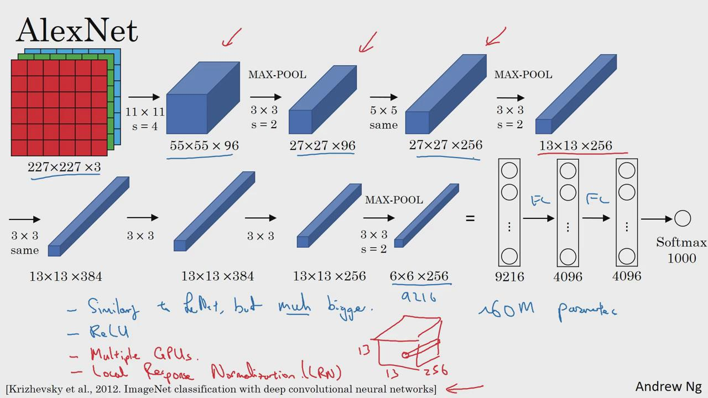
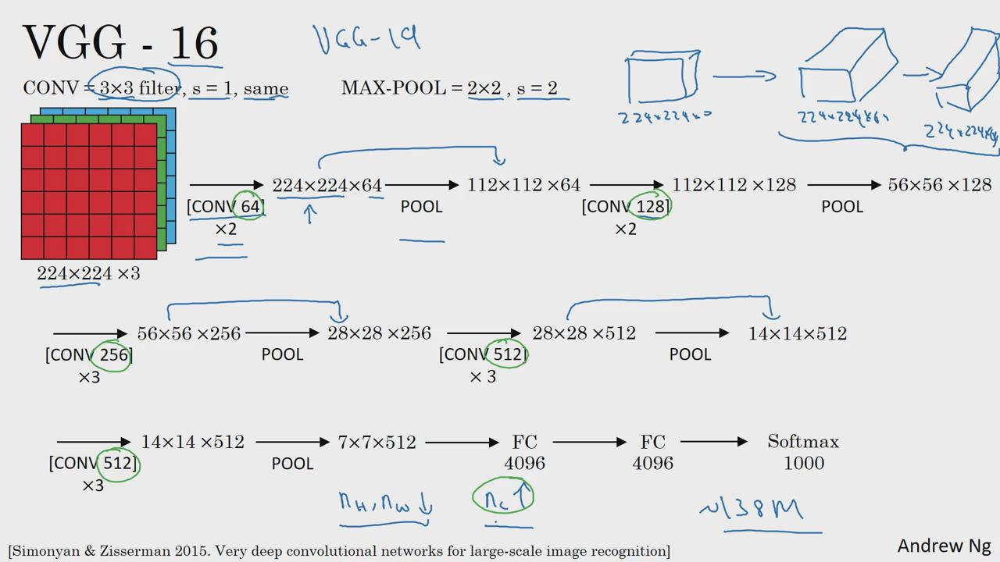

计算机视觉研究中的大量研究，都集中在如何把卷积层，池化层，全连接层这些基本构件组合起来，形成有效的卷积神经网络；

找感觉的最好方法之一，就是去看一些案例，就像学习编程一样，通过研究别人构建有效组件的案例，是个不错的方法；

实际上，在计算机视觉任务中表现良好的神经网络框架，往往也适用于其它任务。

一些经典的神经网络架构范例，当中的一些思路为现代计算机视觉技术的发展奠定了基础。

经典网络：

LeNet-5：

AlexNet

VGG

ResNet：152层


# 1.LeNet-5

paper:http://yann.lecun.com/exdb/publis/pdf/lecun-98.pdf



注：大约6万参数

1.该网络诞生的年代(1980年代)，流行用平均池化，现在更常用的是最大池化；

2.当时并不使用padding；

3.现代版本，最后输出用softmax；

总的来说：

从左到右，随着网络越来越深，图像的宽高在减少，而信道数量在增加；

网络模式，**一个或多个卷积层后面跟着一个池化层，然后又是若干个卷积层，再接一个池化层，然后是全连接层，最后是输出**，
这种排列方式很常用。

如果打算阅读经典论文：

读这篇经典论文，你会发现过去认识使用sigmoid函数和tanh函数，而不是ReLu函数；这种网络特别之处在于，各网络层之间是有关联的；

建议精度第二，泛读第三段

# 2. AlexNet

https://papers.nips.cc/paper/4824-imagenet-classification-with-deep-convolutional-neural-networks.pdf



注：大约6000万参数

1.原文是224x224,但实际227x227更好一些；

2.AlexNet实际上跟LeNet有很多相似之处，不过AlexNet要大得多；它性能优于LeNet主要原因有：

a.含有大量隐藏单元；

b.使用了ReLu激活单元；

3.写这篇论文时，GPU还很慢，所以AlexNet采用了非常复杂的方法在2个GPU上训练，

大致原理是这些层被分拆到2个GPU中运行，还专门设计一个方法用于两个GPU的通信；

经典的AlexNet网络，还有另一种类型的层，“局部响应归一化层”，即LRN层；这类层应用的并不多，现在基本放弃；

了解下深度学习历史，在AlexNet之前，深度学习已经在语音识别和其他领域获得关注，但正是通过这篇论文，计算机视觉领域
开始重视深度学习，并确信深度学习可以应用于计算机视觉领域。此后，深度学习在计算机视觉和其他领域影响力与日俱增。

AlexNet网络看起来相对复杂，包含大量超参数，是比较好理解的适合阅读的一篇paper.

# 3.VGG-16

https://arxiv.org/pdf/1409.1556.pdf



VGG网络没那么多超参数，这是一种只需要专注于构建卷积层的简单网络，

包含1.38亿个参数，即使现在看也是非常庞大的网络，但是其结构并不复杂，这点很吸引人，并且这种网络结构很规整，
都是几个卷积层后面跟着可以压缩的池化层，同时卷积层的过滤器数量变化存在一定的规律。

正是这种设计网络结构的简单规则，相对一致的网路结构对研究者很有吸引力。

它的主要缺点，需要训练的特征数量非常巨大。

有些文章还介绍了VGG-19,它比VGG-16还大，由于VGG-16和VGG-19表现几乎不分高下，所以很多人还是会使用VGG-16;

另一点，**随着网络的加深，图像的高度和宽度都在以一定规律缩小，而信道在不断增加。且这个变化是有规律的**。从这点看，这篇论文很吸引人。

阅读论文，建议从AlexNet开始，VGG, LeNet-5,虽然有些难懂，但对于了解这些网络结构很有帮助

# 残差网络
非常深的网络是很难训练的，因为存在梯度消失和梯度爆炸的问题；

可以从某一网络层获取激活，然后迅速反馈给另外一层，甚至是神经网络的更深层；远眺链接，

利用远眺链接构建能够训练深度网络ResNets，有时超过100层；


```python

```


```python

```


```python

```
