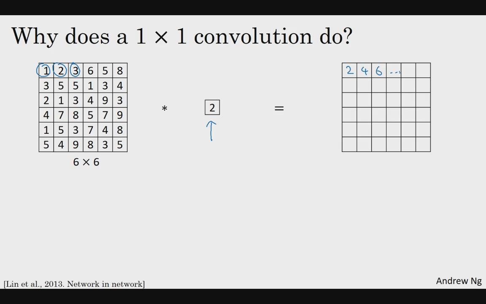
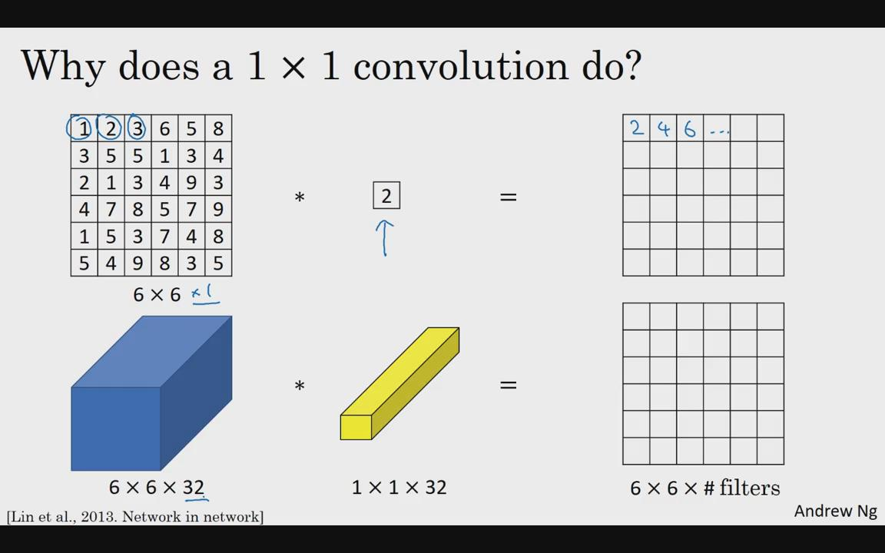
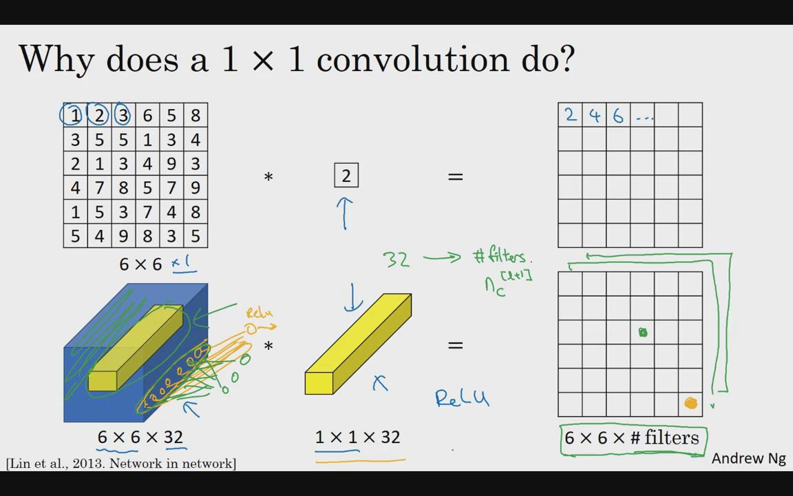
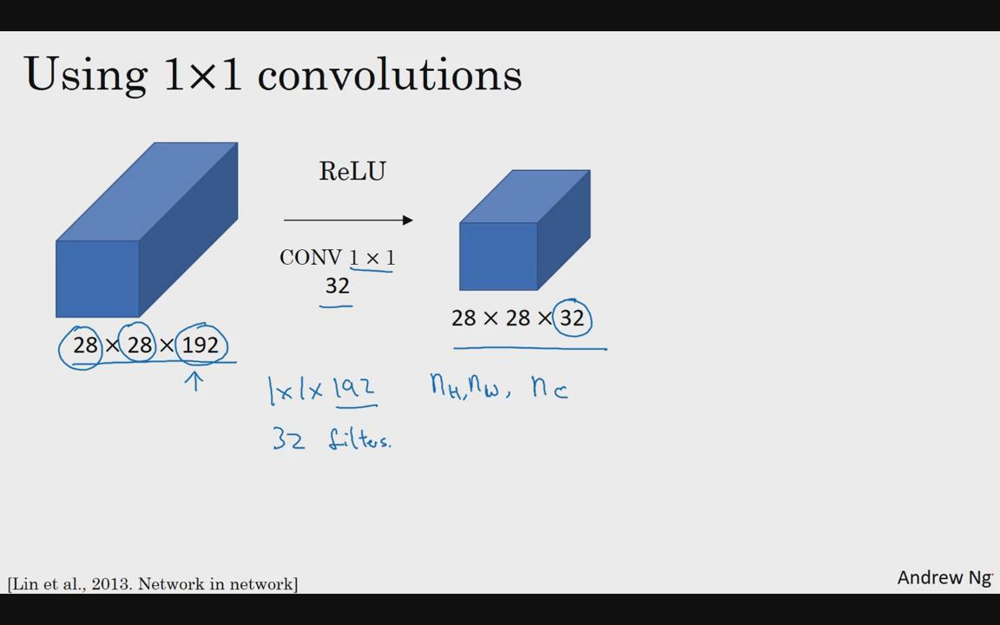

# 1x1卷积可以做什么

假如输入一个6x6二维图片，过滤器尺寸为1x1x1, 做1x1的卷积，只是对输入矩阵乘以某个数字，貌似用处不大；



但这仅仅是对于6x6x1的信道图片来会说1x1效果不佳；

如果是一张6x6x32的图片，那么使用1x1过滤器进行卷积效果如何呢？



具体来说，是遍历这36个单元，每个单元计算左边图中的32个数字和过滤器中32个数字的元素智能乘积，然后运用ReLu非线性函数；


以其中一个单元格为例，它是这个输入层上的某个切片，用卷积核的32个数字乘以输入层上1x1的切片，得到一个实数；
把这个实数画到对应输出单元格中；

这里1x1x32的卷积和1x1x32的切片可以这么理解，一个神经元的输入是32个数字，乘以相同高度和宽度上某个切片的32个数字，
这个32个数字具有不同的信道，乘以32个权重，然后运用ReLu非线性函数；然后输出相应的结果；

一般来说过滤器不止一个，而是多个，就好像有多个输入单元，其输入内容为一个切片上所有数字，输出结果是6x6x过滤器个数；





所以1x1卷积可以从根本上理解为，这32个单元都应用了一个全连接神经网络；

全连接层的作用是输入32个数字，和过滤器个数，在26个单元上重复此过程，输出结果是6x6x滤波器个数；

这种方法就叫做1x1卷积，有时也被称为Network in Network


## 1x1卷积实例：

假设一个28x28x192的输入层，你可以使用池化层优化宽和高，但是如果信道数量很大，如何压缩到28x28x32呢，可以使用32个大小为1x1的过滤器；



严格来说，每个过滤器大小都是1x1x192，过滤器的信道数量必须与输入层信道数量相等；

当然，要保持信道192不变也是可以的，这时1x1卷积相当于只添加了非线性函数；

也可以增加信道数量，这个特性在inception网络中有应用；

小结：池化层可以压缩宽度和高度，1x1卷积可以改变信道数量；


```python

```


```python

```
