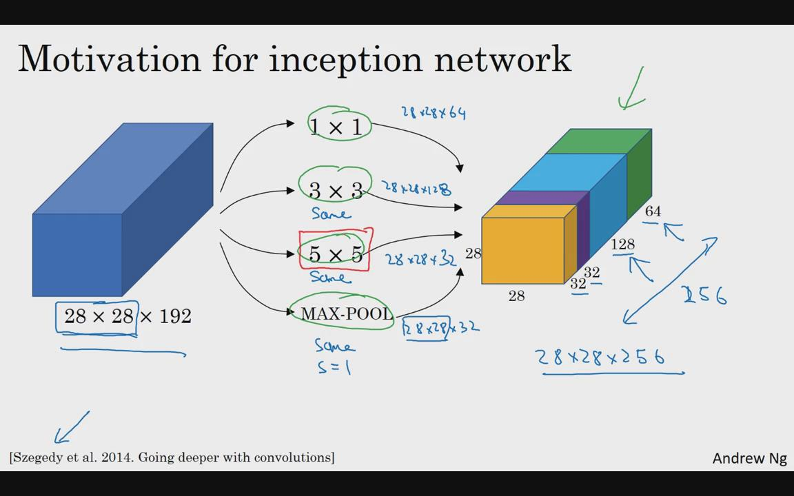
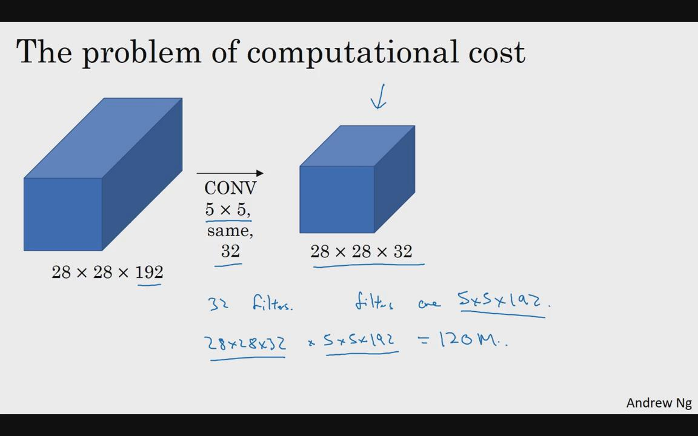
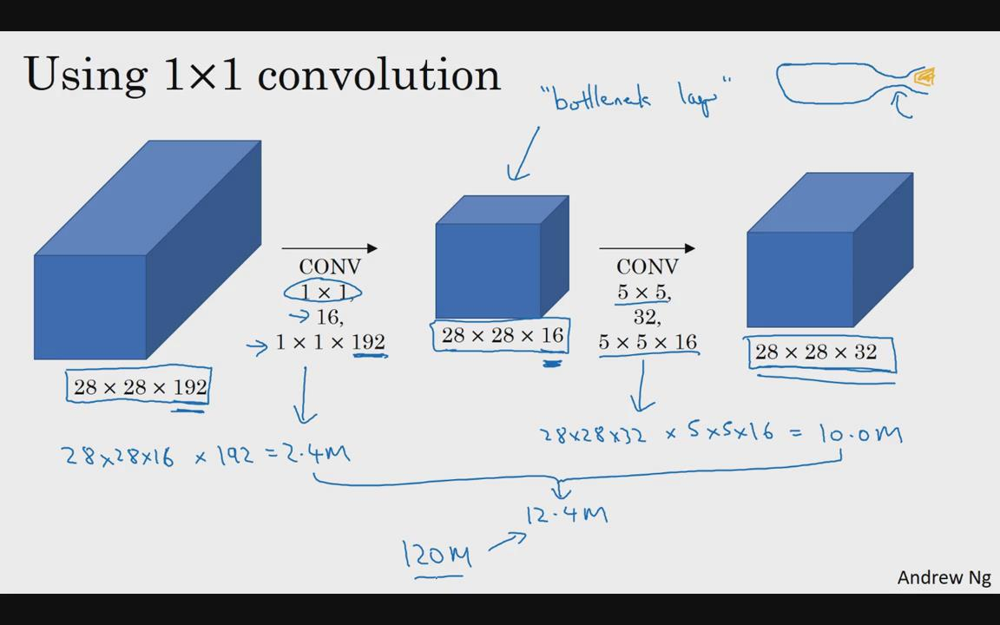
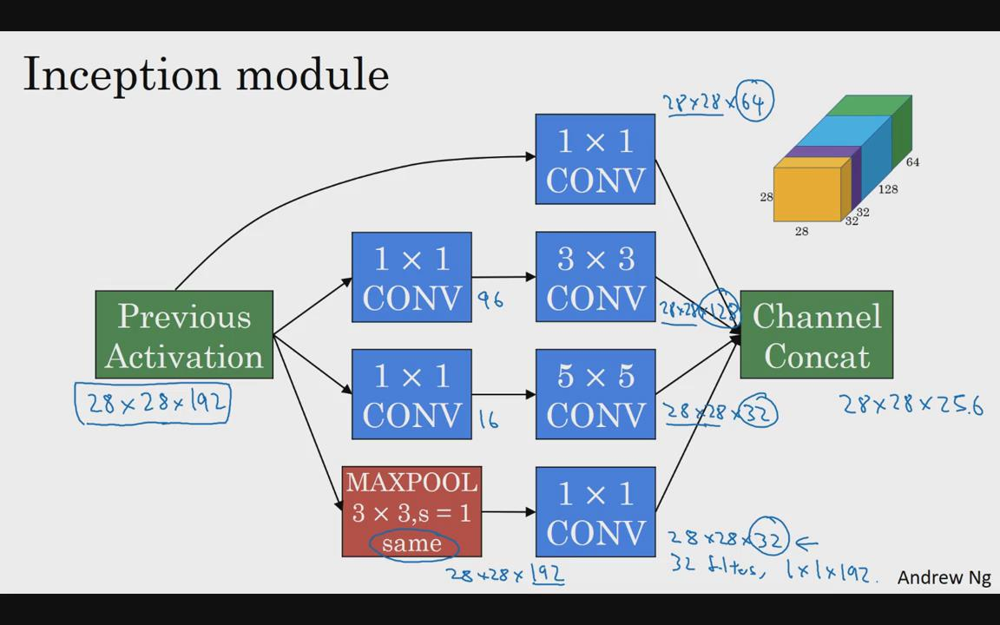
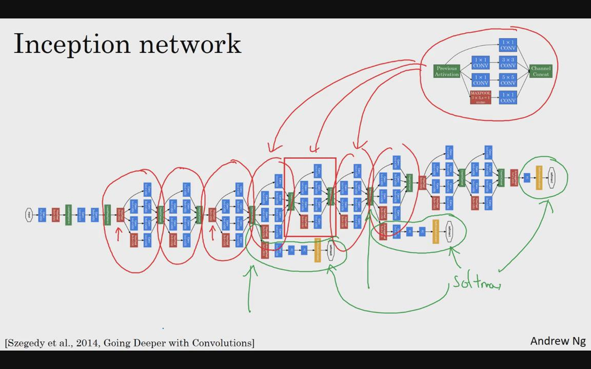

# 谷歌Inception网络：

构建卷积层时，你要决定卷积核的大小究竟是 1×1，3×3 还 是 5×5，或者要不要添加池化层。而 Inception 网络的作用就是代替你来决定，虽然网络架
构因此变得更加复杂，但网络表现却非常好.

## 1.Inception基本思想：



同时添加多个滤波器，将每个滤波器输出叠加一起，作为总输出，让网络自己学习它需要什么样的参数，采用哪些过滤器组合。

注：多个滤波器输出的维度应该相同；比如MAX-POOL采取特殊的池化层，保证输出维度28x28

## 缺点：显而易见，Inceptin网络计算量非常庞大；

以5x5卷积核为例：



由上图知，大概有1.2亿参数

## 2.使用 1×1 卷积来构建瓶颈层，从而大大降低计算成本

添加用1x1卷积层，即"瓶颈层"；

瓶颈通常是某个对象最小的部分，瓶颈层也是网络中最小的部分，我们先缩小网络表示，然后再扩大它。



参数量12.4M, 下降为原来的十分之一。

事实证明，只要合理构建瓶颈层，既可以显著缩小表示层规模，又不会降低网络性能，从而节省了计算。

# googleLeNet

https://arxiv.org/pdf/1409.4842.pdf

一个典型的Inception module



注意：池化层后加一个1x1卷积改变信道数量；

Inception网络，就是在不同位置，重复使用Inception模块组成。



由论文原文可知，还添加了一些分支，在网络最后基层，通常称为全连接层，之后再链接一个softmax层做预测；

这些分支，应该看着Inception网络的一个细节，确保了即便是隐藏单元和中间层也参与了特征计算，它们也能预测图片分类，也参与了特征计算，它们能预测图片的分类。

在 Inception网络中，起到一种调整的效果，并且能防止网络发生过拟合。

还有这个特别的Inception网络是由Google公司的作者所研发的，它被叫做GoogleLeNet，这个名字是为了向 LeNet 网络致敬。在之前的视频中你应该了解了 LeNet 网络。

最后，有个有趣的事实，Inception 网络这个名字又是缘何而来呢？Inception 的论文特地提到了这个meme，网络用语即“梗”，就是“我们需要走的更深”（We need to go deeper），

论文还引用了这个网址（http://knowyourmeme.com/memes/we-need-to-go-deeper），
连接到这幅图片上，

如果你看过 Inception（盗梦空间）这个电影，你应该能看懂这个由来。

作者其实是通过它来表明了建立更深的神经网络的决心，他们正是这样构建了 Inception。

GoogLeNet/Inception in Keras

from keras.applications.inception_v3 import InceptionV3

model = InceptionV3(weights='imagenet', include_top=False)


```python

```
