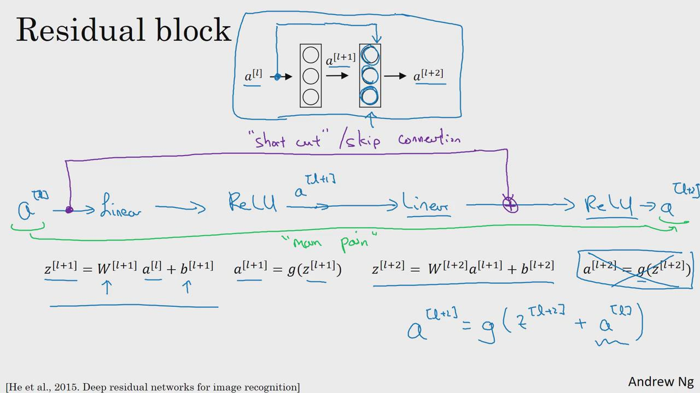
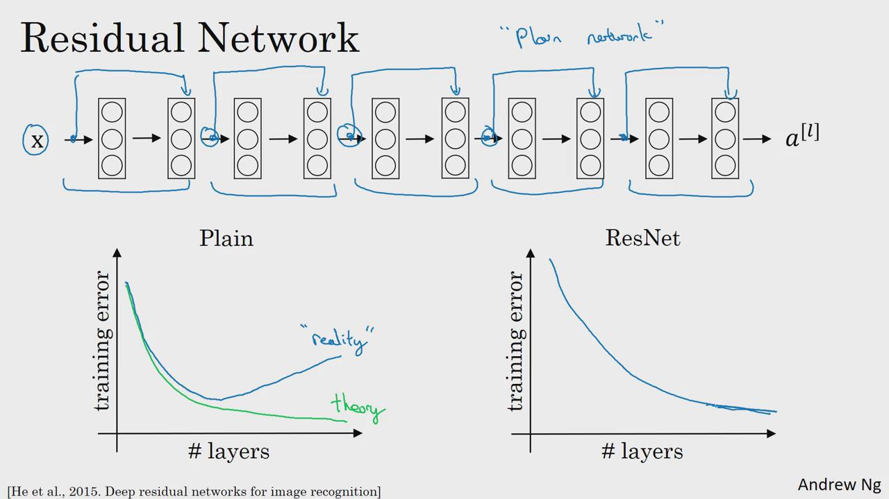
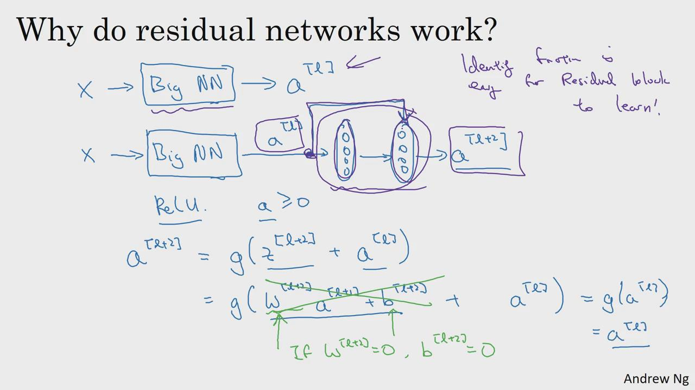
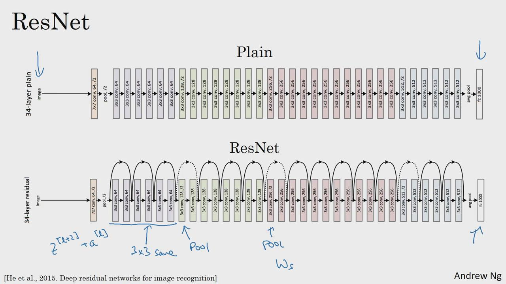

# 残差网络

非常深的网络是很难训练的，因为存在梯度消失和梯度爆炸的问题；

**远眺链接**:可以从某一网络层获取激活，然后迅速反馈给另外一层，甚至是神经网络的更深层；

利用远眺链接构建能够训练深度网络ResNets，有时超过100层；

## 残差块

将$a^{[l]}$直接向后拷贝到网络深层，$a^{[l+2]}$，连接点在ReLu非线性激活前，线性激活$z^{[l+2]}$之后

这样$a^{[l+2]}$的非线性输出就变成$a^{[l+2]} = g(z^{[l+2]}+a^{[l]})$

也就是说$a^{[l+2]}$加上了$a^{[l]}$这个残差块；

这个叫捷径(shorcut)，有时候会听到另一个术语“远眺链接”(skip connection),就是指$a^{[l]}$跳过一层或好几层，
将信息传递到神经网络的更深层。

ResNet发明者发现用残差块可以训练更深网络，所以构建一个ResNet网络就是通过将很多这样的残差块堆积在一起，形成一个深度神经网络。

## 残差网络Residual Network

如上图所示，5个残差块链接在一起，构成一个残差网络；（除去蓝色手写部分，即是添加残差块之前的普通网络plain network）

对比普通网络，使用标准优化算法训练一个普通网络，如果没有多余的残差，或者远眺链接，凭经验可知，随网络层数增加，
训练错误会先增加后减小(如上图左)，而理论上应该训练的越来越好才对,因为理论上网络越深越好。
实际上，对于普通网络，网络越深，用优化算法越难训练，出现错误越多；

有了ResNets就不一样，即使网络再深，训练的表现也不错，甚至有人在1000多层的神经网络做过实验。

这种方式有助于解决梯度消失和梯度爆炸的问题；让我们可以在训练更深网络的时候，又能保证良好的性能。

也许从另外一个角度看，网络会变得臃肿，但是ResNet确实在训练深度网络方面非常有效；

# 为什么ResNet能有如此好表现呢？

通常来讲，一个网络深度越深，它在训练集上训练的效率就会有所减弱，这也是有时候我们不希望加深网络的原因。而事实并非如此，至少在训练 ResNets
网络时，并非完全如此，举个例子。

如图，为方便说明，假设都是采用ReLu激活函数，在一个大网络big NN后面添加两层，

$a^{[l+2]} = g(z^{[l+2]}+a^{[l]})=g(w^{[l+2]}a^{l+1} + b^{[l+2]} +a^{[l]})$

如果使用L2正则化会压缩$w^{[l+2]}$的值,对b应用权重衰减也有同样效果，虽然不常用；

这里假设w=0,b=0，这几项就没了，
$a^{[l+2]}= g(a^{[l]}) = a^{[l]}$

也就是这个远眺链接是我们很容易得出恒等式$a^{[l+2]}= a^{[l]}$，

这意味着即使给神经网络增加了这两层，网络的效率不逊色于普通网络，因为学习恒等式相对容易；

而相对普通网络，添加残差网络可以学习到更多隐藏参数；

因此创建类似的残差网络可以提神网络性能。

另一个值得注意，$a^{[l]}$和$z^{[l+2]}$一般具有相同维度，之所以能实现跳跃链接是因为same卷积保留了维度，所以很容易得出跳跃链接，并输出两个相同维度的向量。

如果输入和输出有不同维度，那么就会生出一个$W_s$矩阵，将$a^{[l]}$和$z^{[l+2]}$维度统一。

## ResNet

下面是从论文中截取的网络

上图是个普通网络，输入一张图片，结果多个卷基层，最后输出一个softmax.

添加跳跃链接(same卷积保留了网络维度)，就构成一个残差网络。

## ResNet in Keras

from keras.applications.resnet50 import ResNet50

model = ResNet50(weights='imagenet', include_top=False)
